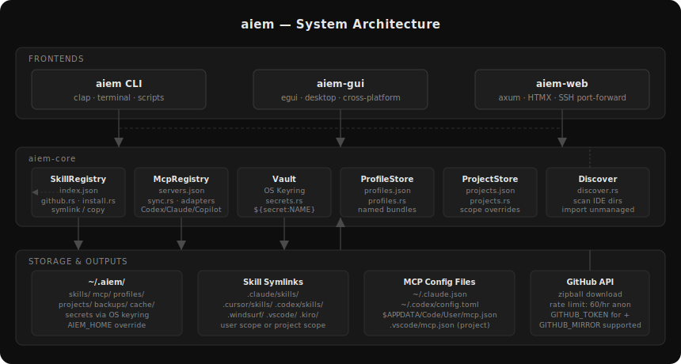
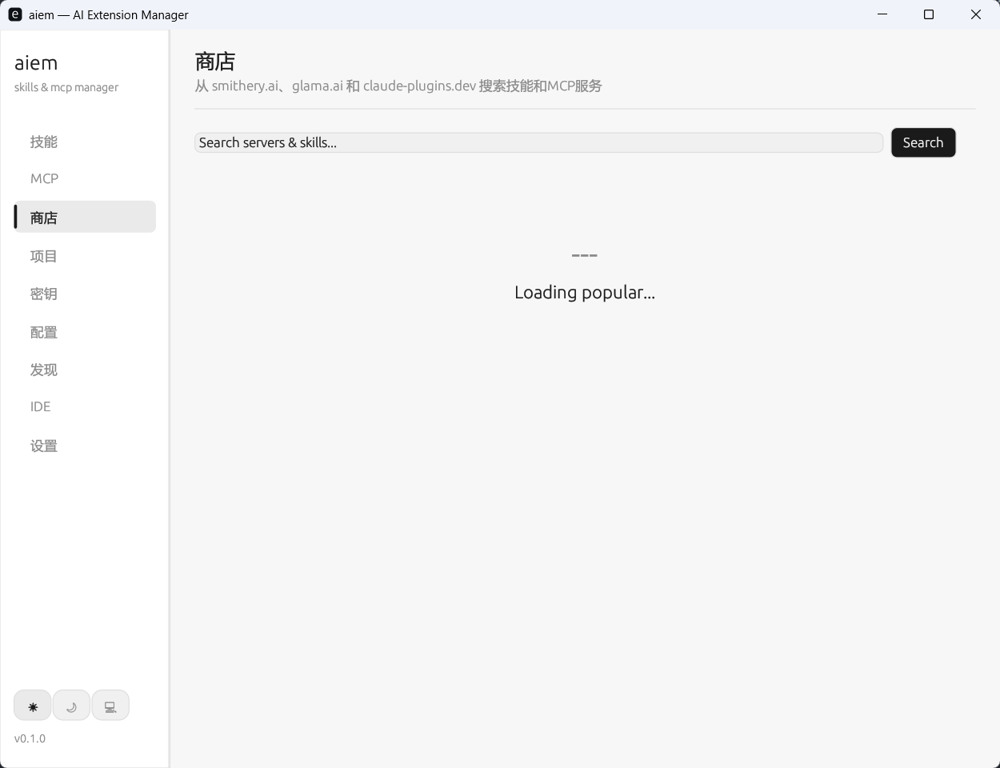
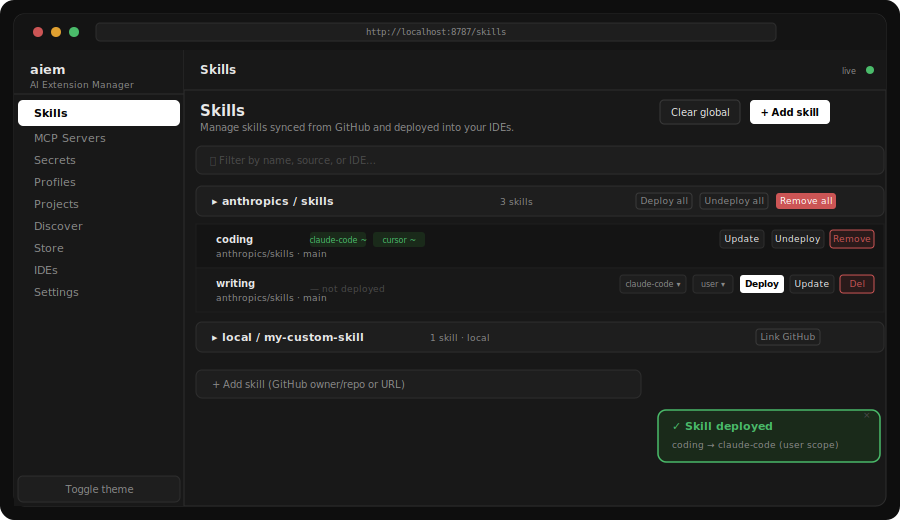
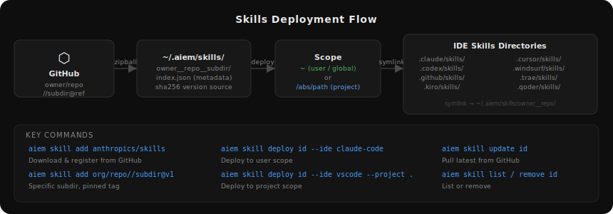
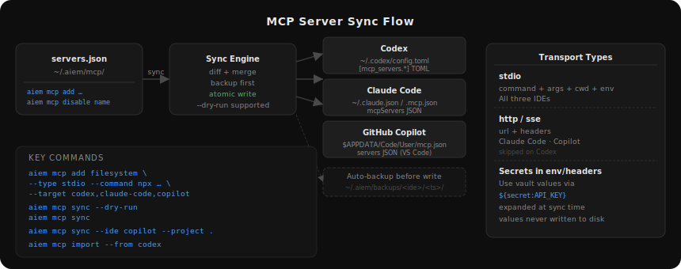

# aiem

AI Extension Manager for Skills and MCP servers.

`aiem` is a Rust workspace that provides one consistent control plane for three things that are usually fragmented across AI IDEs and local scripts:

- AI skills / prompt packages synced from GitHub
- MCP server definitions synced into native IDE config files
- Three frontends over the same core: CLI, desktop GUI, and headless Web UI

<p align="center">
  <a href="#zh-cn">中文</a> ·
  <a href="#english">English</a>
</p>

<p align="center">
  
</p>

---

<a id="zh-cn"></a>

## 中文

### 项目概述

`aiem` 试图解决一个很具体的问题：现在不同 AI IDE 对 Skills 和 MCP 的存储路径、配置格式、作用域模型都不一样，团队和个人一旦同时使用 Claude Code、Codex、Copilot、Cursor、Windsurf 等工具，就很容易出现这些问题：

- 同一个 skill 需要重复下载、重复部署
- MCP server 需要分别写到多份配置里，容易漂移
- 本地 GUI、远程 Linux、脚本自动化三套使用方式彼此割裂
- 敏感信息容易被直接写进配置文件，而不是走系统 keyring

`aiem` 的做法是把“技能仓库”“MCP 注册表”“密钥管理”“项目 / 配置集”统一收敛到 `aiem-core`，然后在这个 core 之上提供三种前端：

- `aiem`：命令行，适合自动化、脚本、CI、远程维护
- `aiem-gui`：桌面 GUI，适合本机可视化管理
- `aiem-web`：浏览器 Web UI，适合无头 Linux 服务器，通过 SSH 端口转发访问

### 主要能力

- Skills：从 GitHub 拉取、更新、删除，并部署到多个 IDE 的 skills 目录
- MCP：统一维护 MCP server 注册表，再同步到各 IDE 的原生配置文件
- Secrets：敏感值存入系统 keyring，在 MCP env / headers 中通过 `${secret:NAME}` 引用
- Profiles：按“工作流 / 角色 / 项目群”组织 skills 和 MCP 的子集
- Projects：按项目记录 IDE、技能和作用域信息
- Discover：扫描本机现有 IDE 配置和技能目录，导入尚未由 aiem 管理的资源
- Store：从 `smithery.ai`、`glama.ai`、`claude-plugins.dev` 搜索技能和 MCP 服务
- Web 管理：远程 Linux 主机只监听 `127.0.0.1`，通过 SSH 端口转发安全访问

### 前端形态

| 前端 | 二进制 | 典型场景 | 技术栈 |
| --- | --- | --- | --- |
| CLI | `aiem` | 自动化、脚本、SSH、CI | Rust + clap |
| Desktop GUI | `aiem-gui` | 本机桌面管理 | Rust + egui |
| Web UI | `aiem serve` | 无头 Linux / 浏览器远程管理 | Rust + axum + maud + HTMX |

### 界面示意

下面的图片混合了真实运行截图和结构示意图，便于快速理解产品形态与数据流。

#### Skills 页面（真实截图）

<p align="center">
  
</p>

#### Discover 页面（真实截图）

<p align="center">
  
</p>

#### Store 页面（真实截图）

<p align="center">
  
</p>

#### Web UI Skills 视图（示意图）

<p align="center">
  
</p>

### 架构与数据边界

`aiem` 的核心原则是“一个真实来源，多种前端视图”。

- `aiem-core` 负责所有真实业务状态和文件读写
- CLI / GUI / Web UI 只是在不同场景下操作相同的 registry / store
- Skills 和 MCP 不直接散落在各 IDE 内，而是先进入 `~/.aiem/` 再进行部署或同步
- 同步 IDE 原生配置前会先备份，尽量避免破坏用户已有配置

核心存储包括：

- `~/.aiem/skills/`：缓存并索引 GitHub skills
- `~/.aiem/mcp/servers.json`：统一的 MCP server 注册表
- `~/.aiem/backups/`：同步前自动备份
- `~/.aiem/profiles/`、`projects/`：配置集与项目记录
- 系统 keyring：Secret 值本体不落盘

### 安装与构建

#### 环境要求

- Rust stable `>= 1.75`
- Windows、Linux、macOS 之一
- 如果需要桌面 GUI，请确保平台具备相应图形依赖

#### 从源码构建

```bash
cargo build --workspace
```

发布构建：

```bash
cargo build --release
```

主要产物：

- `target/release/aiem`
- `target/release/aiem-gui`

如果你只想要 CLI + Web，而不构建 GUI，可以只构建 CLI 包：

```bash
cargo build --release -p aiem-cli
```

#### 预编译版本

GitHub Actions 已配置 Release 构建，当前预期产物如下：

- Windows x86_64：`aiem.exe` + `aiem-gui.exe`
- Linux x86_64 GNU：`aiem` + `aiem-gui`
- Linux x86_64 musl：`aiem`（无 GUI，适合纯 headless）
- macOS x86_64 / arm64：`aiem` + `aiem-gui`

### 快速开始

初始化默认目录：

```bash
aiem init
```

查看支持的 skills IDE：

```bash
aiem ide list
```

查看支持的 MCP IDE：

```bash
aiem mcp supported
```

#### 常用环境变量

- `AIEM_HOME`：覆盖默认的 `~/.aiem`
- `GITHUB_TOKEN`：提高 GitHub API 限额，避免匿名限流
- `GITHUB_MIRROR`：在受限网络或镜像场景下替换 GitHub 下载源

### Skills 管理

Skills 的典型流程是：从 GitHub 拉取到本地 registry，然后按用户或项目作用域部署到 IDE 的技能目录。

<p align="center">
  
</p>

#### 添加 skill

```bash
# 整个仓库
aiem skill add anthropics/skills

# 指定子目录并固定 tag
aiem skill add anthropics/skills//writing@v1.2.3

# 也支持 GitHub URL
aiem skill add https://github.com/anthropics/skills
```

#### 查看、更新、移除

```bash
aiem skill list
aiem skill info anthropics__skills
aiem skill update anthropics__skills
aiem skill remove anthropics__skills
```

#### 部署到 IDE

```bash
# 用户作用域
aiem skill deploy anthropics__skills --ide claude-code

# 项目作用域
aiem skill deploy anthropics__skills --ide vscode --project .

# 同步到多个 IDE
aiem skill sync anthropics__skills --ides claude-code,cursor,vscode --project .

# 取消部署
aiem skill undeploy anthropics__skills --ide claude-code
```

#### 支持的 Skills IDE

| ID | 显示名称 | 技能目录 | 默认作用域 |
| --- | --- | --- | --- |
| `claude-code` | Claude Code | `.claude/skills` | User |
| `codex` | Codex | `.codex/skills` | User |
| `cursor` | Cursor | `.cursor/skills` | Project |
| `vscode` | VSCode / Copilot | `.github/skills` | Project |
| `windsurf` | Windsurf | `.windsurf/skills` | Project |
| `trae` | Trae | `.trae/skills` | Project |
| `qoder` | Qoder | `.qoder/skills` | Project |
| `kiro` | Kiro | `.kiro/skills` | Project |

### MCP 管理

MCP 的工作方式是：先把 server 定义存到 `aiem` 自己的 registry，再按目标 IDE 的格式写回对应配置文件。

<p align="center">
  
</p>

#### 注册 MCP server

```bash
# stdio server
aiem mcp add filesystem \
  --type stdio \
  --command npx --arg -y --arg @modelcontextprotocol/server-filesystem --arg . \
  --target codex,claude-code,copilot \
  --description "Local filesystem browser"

# HTTP / SSE server
aiem mcp add remote-tool \
  --type http \
  --url https://mcp.example.com/sse \
  --header Authorization=Bearer\ xxx \
  --target claude-code,copilot
```

#### 列出、查看、禁用、移除

```bash
aiem mcp list
aiem mcp show filesystem
aiem mcp disable filesystem
aiem mcp enable filesystem
aiem mcp remove filesystem
```

#### 同步到 IDE

```bash
# 先看计划，不落盘
aiem mcp sync --dry-run

# 写入所有目标 IDE
aiem mcp sync

# 仅同步某个 IDE
aiem mcp sync --ide codex

# 项目作用域
aiem mcp sync --ide copilot,claude-code --project .
```

#### 导入已有配置

```bash
aiem mcp import --from codex
```

#### 查看目标配置路径

```bash
aiem mcp path --ide codex
aiem mcp path --ide copilot --project .
```

#### 当前支持的 MCP IDE

| IDE | 作用域 | 原生配置 |
| --- | --- | --- |
| `codex` | User | `~/.codex/config.toml` |
| `claude-code` | User / Project | `~/.claude.json` / `.mcp.json` |
| `copilot` | User / Project | VS Code 用户态 `mcp.json` / 项目态 `.vscode/mcp.json` |

说明：

- Codex 当前只支持 `stdio` 传输，`http/sse` 会被跳过
- Claude Code / Copilot 支持 `stdio` 和 `http/sse`
- 每次写入前都会做备份

### Secrets、Profiles、Projects、Discover、Store

除了 Skills 和 MCP，`aiem` 还覆盖了一整套周边管理能力：

- `secret`：将凭据存入系统 keyring，避免把敏感值直接写进配置文件
- `profile`：管理命名配置集，适合按团队 / 项目类型切换
- `projects`：记录项目路径、适配 IDE、技能作用域等信息
- `discover`：扫描现有环境，把尚未纳入 `aiem` 的技能和 MCP 配置导入进来
- `store`：在线搜索流行 MCP 服务和 skills，降低冷启动成本

### Web UI 与远程 Linux 使用方式

`aiem-web` 的设计目标不是对外暴露一个公网服务，而是安全地管理远程无头主机上的环境。

推荐方式：

```bash
# 远程机器
aiem serve --host 127.0.0.1 --port 8787

# 本地机器
ssh -L 8787:localhost:8787 user@server
```

然后在本地浏览器打开：

```text
http://localhost:8787
```

安全边界建议：

- 默认只监听 `127.0.0.1`
- 不要直接暴露到公网，除非有反向代理和认证层
- 将 SSH 作为认证边界
- `GITHUB_TOKEN`、第三方 API key 通过 keyring 或 secret 管理，不要直接写 systemd 环境变量

### 项目结构

```text
aiem/
├── Cargo.toml
├── crates/
│   ├── aiem-core/   # skills / mcp / secrets / profiles / projects / discover
│   ├── aiem-cli/    # CLI frontend
│   ├── aiem-gui/    # egui desktop frontend
│   └── aiem-web/    # axum + maud + HTMX web frontend
├── docs/
│   └── images/      # architecture / flow diagrams
└── pic/             # runtime screenshots used in README
```

### 适合的使用场景

- 你同时使用多个 AI IDE，希望统一管理 skills 和 MCP
- 你在本机上喜欢 GUI，但在远程 Linux 上需要浏览器式管理
- 你希望将敏感配置从项目目录里抽离出去，改走系统 keyring
- 你需要先手工配置、后统一回收，或者从现有环境中自动 discover / import

### 开发与发布

- CI：在 GitHub Actions 上构建 workspace 并执行测试
- Release：tag 触发多平台构建并生成压缩包与 SHA256 文件
- 当前仓库已包含 MIT License 与 GitHub Release workflow

### License

MIT

---

<a id="english"></a>

## English

### Overview

`aiem` is a Rust workspace that unifies skill packages and MCP server management across multiple AI IDEs.

Instead of maintaining separate skill folders, hand-edited MCP configs, ad hoc shell scripts, and one-off desktop tools, `aiem` centralizes everything in one core layer and exposes it through three frontends:

- `aiem` for CLI automation and scripting
- `aiem-gui` for local desktop management
- `aiem-web` for browser-based management on headless or remote machines

The project is designed around one source of truth and multiple operational surfaces.

### What aiem manages

- Skills synced from GitHub and deployed into IDE-specific skill folders
- MCP server definitions stored in a central registry and synchronized back into native IDE config files
- Secrets stored in the OS keyring and referenced as `${secret:NAME}`
- Profiles and project metadata used to organize different environments
- Existing unmanaged skills / MCP configs discovered on disk and imported into aiem
- Online search across `smithery.ai`, `glama.ai`, and `claude-plugins.dev`

### Frontends

| Frontend | Binary | Best for | Stack |
| --- | --- | --- | --- |
| CLI | `aiem` | automation, SSH, scripts, CI | Rust + clap |
| Desktop GUI | `aiem-gui` | local visual management | Rust + egui |
| Web UI | `aiem serve` | remote headless Linux, browser access | Rust + axum + maud + HTMX |

### Screenshots and diagrams

#### Desktop GUI Skills page

<p align="center">
  
</p>

#### Desktop GUI Discover page

<p align="center">
  
</p>

#### Desktop GUI Store page

<p align="center">
  
</p>

#### Web UI overview mock

<p align="center">
  
</p>

### Installation and build

Requirements:

- Rust stable `>= 1.75`
- Windows, Linux, or macOS
- GUI-capable platform dependencies if you want to build `aiem-gui`

Build the whole workspace:

```bash
cargo build --workspace
```

Release build:

```bash
cargo build --release
```

Main outputs:

- `target/release/aiem`
- `target/release/aiem-gui`

If you only want CLI + Web, build the CLI package:

```bash
cargo build --release -p aiem-cli
```

### Prebuilt release artifacts

GitHub Actions is configured to publish multi-platform release assets:

- Windows x86_64: `aiem.exe` + `aiem-gui.exe`
- Linux x86_64 GNU: `aiem` + `aiem-gui`
- Linux x86_64 musl: `aiem` only, intended for pure headless deployment
- macOS x86_64 / arm64: `aiem` + `aiem-gui`

### Quick start

Initialize the default home:

```bash
aiem init
```

List supported skill IDEs:

```bash
aiem ide list
```

List supported MCP IDEs:

```bash
aiem mcp supported
```

Useful environment variables:

- `AIEM_HOME` to override `~/.aiem`
- `GITHUB_TOKEN` to avoid anonymous GitHub rate limits
- `GITHUB_MIRROR` to redirect GitHub downloads in mirrored or restricted environments

### Skills workflow

<p align="center">
  
</p>

Add a skill:

```bash
aiem skill add anthropics/skills
aiem skill add anthropics/skills//writing@v1.2.3
aiem skill add https://github.com/anthropics/skills
```

Inspect and maintain:

```bash
aiem skill list
aiem skill info anthropics__skills
aiem skill update anthropics__skills
aiem skill remove anthropics__skills
```

Deploy:

```bash
aiem skill deploy anthropics__skills --ide claude-code
aiem skill deploy anthropics__skills --ide vscode --project .
aiem skill sync anthropics__skills --ides claude-code,cursor,vscode --project .
aiem skill undeploy anthropics__skills --ide claude-code
```

Supported skill IDEs:

| ID | Display name | Skill directory | Default scope |
| --- | --- | --- | --- |
| `claude-code` | Claude Code | `.claude/skills` | User |
| `codex` | Codex | `.codex/skills` | User |
| `cursor` | Cursor | `.cursor/skills` | Project |
| `vscode` | VSCode / Copilot | `.github/skills` | Project |
| `windsurf` | Windsurf | `.windsurf/skills` | Project |
| `trae` | Trae | `.trae/skills` | Project |
| `qoder` | Qoder | `.qoder/skills` | Project |
| `kiro` | Kiro | `.kiro/skills` | Project |

### MCP workflow

<p align="center">
  
</p>

Register a server:

```bash
aiem mcp add filesystem \
  --type stdio \
  --command npx --arg -y --arg @modelcontextprotocol/server-filesystem --arg . \
  --target codex,claude-code,copilot

aiem mcp add remote-tool \
  --type http \
  --url https://mcp.example.com/sse \
  --header Authorization=Bearer\ xxx \
  --target claude-code,copilot
```

Operate on the registry:

```bash
aiem mcp list
aiem mcp show filesystem
aiem mcp disable filesystem
aiem mcp enable filesystem
aiem mcp remove filesystem
```

Sync to IDEs:

```bash
aiem mcp sync --dry-run
aiem mcp sync
aiem mcp sync --ide codex
aiem mcp sync --ide copilot,claude-code --project .
```

Import existing config and inspect target path:

```bash
aiem mcp import --from codex
aiem mcp path --ide codex
aiem mcp path --ide copilot --project .
```

Supported MCP IDEs:

| IDE | Scope | Native config |
| --- | --- | --- |
| `codex` | User | `~/.codex/config.toml` |
| `claude-code` | User / Project | `~/.claude.json` / `.mcp.json` |
| `copilot` | User / Project | VS Code `mcp.json` / `.vscode/mcp.json` |

Notes:

- Codex currently supports `stdio` only
- Claude Code and Copilot support both `stdio` and `http/sse`
- aiem creates backups before writing managed config

### Secrets, profiles, projects, discover, and store

Beyond skills and MCP, aiem also includes:

- `secret`: OS-keyring-backed secret storage
- `profile`: named subsets of skills and MCP servers
- `projects`: project metadata and scope tracking
- `discover`: scan current machine state and import unmanaged resources
- `store`: search external registries for popular servers and skills

### Web UI for headless or remote Linux

The Web UI is intentionally designed for loopback binding plus SSH port forwarding.

Recommended usage:

```bash
# remote machine
aiem serve --host 127.0.0.1 --port 8787

# local machine
ssh -L 8787:localhost:8787 user@server
```

Then open:

```text
http://localhost:8787
```

Security guidance:

- Keep the service bound to `127.0.0.1` by default
- Do not expose it directly to the public internet without a proper auth layer
- Treat SSH as the primary security boundary
- Keep API keys in the keyring or aiem secrets flow instead of flat config files

### Repository layout

```text
aiem/
├── Cargo.toml
├── crates/
│   ├── aiem-core/
│   ├── aiem-cli/
│   ├── aiem-gui/
│   └── aiem-web/
├── docs/images/
└── pic/
```

### Release and license

- CI builds the workspace and runs tests on GitHub Actions
- Release tags produce platform archives and checksum files
- License: MIT