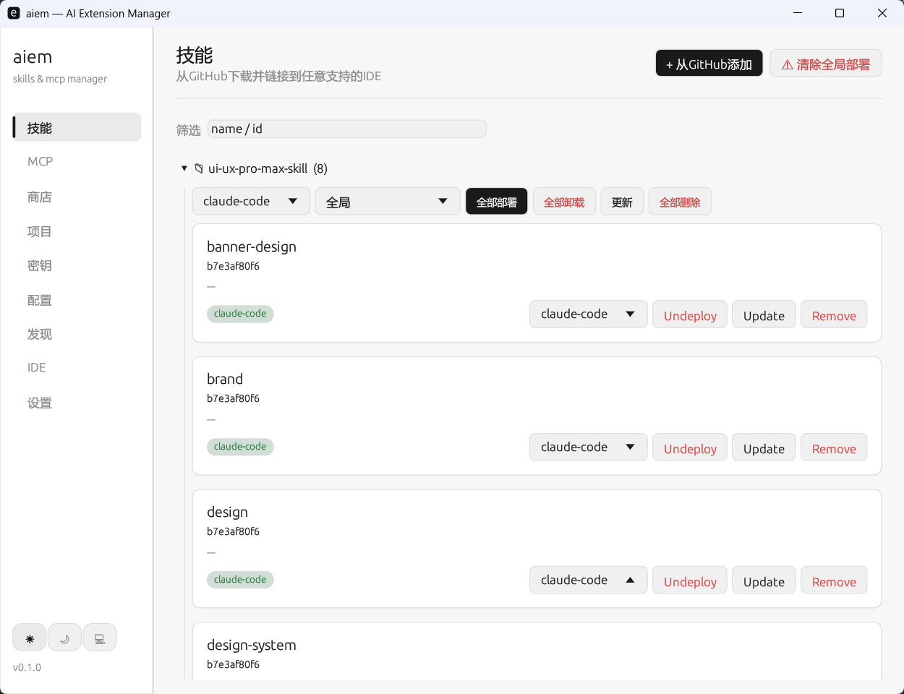
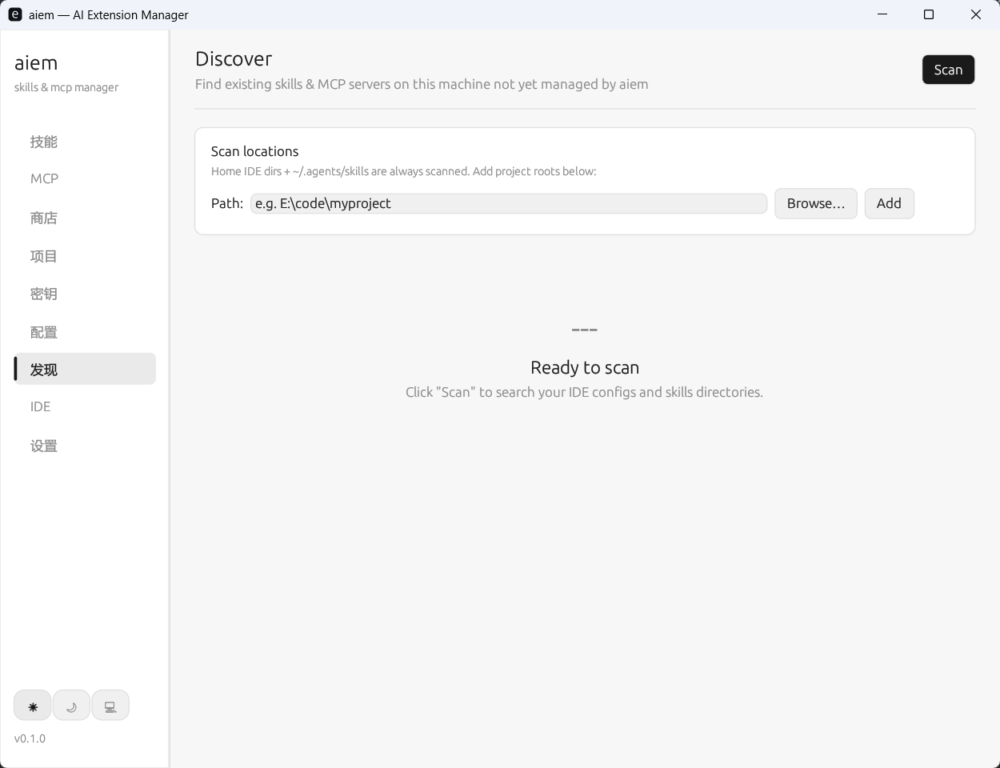

# aiem Web UI

Web UI 是 aiem 的浏览器管理界面，由 `aiem` 二进制程序直接提供，不需要 Node.js。



## 启动

```powershell
aiem serve --host 127.0.0.1 --port 8787 --open
```

如果部署在远程机器上，建议保持服务只监听本地地址，然后通过 SSH 转发访问：

```bash
aiem serve --host 127.0.0.1 --port 8787
ssh -L 8787:localhost:8787 user@server
```

随后在本机打开：

```text
http://127.0.0.1:8787
```

## 页面预览




## 主要页面

| 页面 | 路径 | 用途 |
|---|---|---|
| Skills | `/skills` | 安装、更新、部署、移除和查看 Skills |
| MCP 服务 | `/mcp` | 添加、部署、移除、启用、禁用和查看 MCP 服务 |
| 项目 | `/projects` | 将 IDE、Skills 和 MCP 服务绑定到一个工作区 |
| 发现 | `/discover` | 扫描本地 IDE 配置并导入未托管资源 |
| 密钥 | `/secrets` | 把密钥保存到系统密钥环 |
| IDE 设置 | `/ides` | 查看和管理支持的 IDE 目标 |
| 设置 | `/settings` | 配置 GitHub token、备份、路径和运行信息 |

## 语言

Web UI 支持中文和英文。语言切换状态会保存在浏览器本地，下次打开时继续沿用。

## Notes

The Web UI is embedded in the `aiem` binary. Use `aiem serve --open` for local management, or bind to `127.0.0.1` and use SSH forwarding on remote machines.
